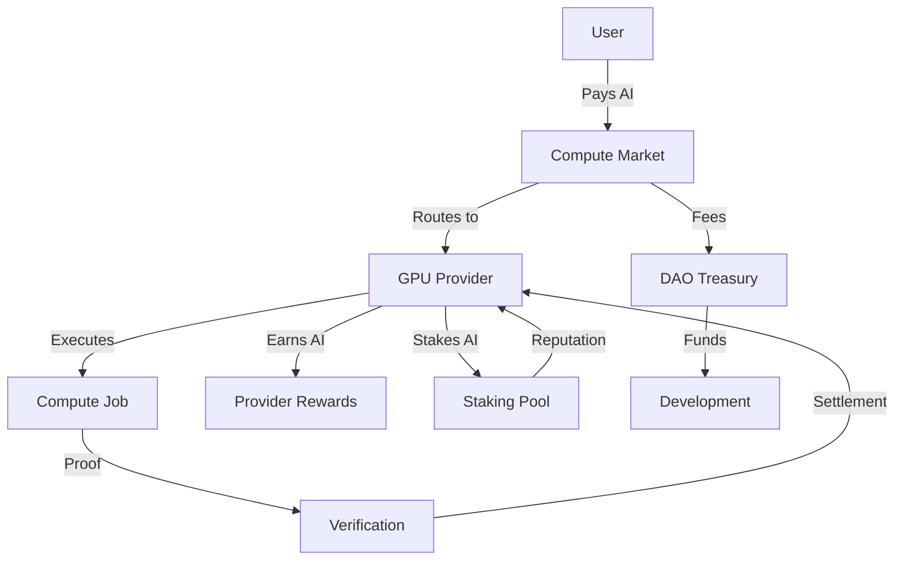

# AI Token Economics - Hanzo Network

## Overview

The AI token powers the Hanzo decentralized compute marketplace, serving as both the governance token and payment medium for all AI/compute services.

## Token Model

### Dual Token System

1. **AI Token** (Governance & Payment)
   - Total Supply: 1,000,000,000 AI
   - Decimals: 18
   - Standard: ERC-20 compatible
   - Use: Governance, staking, compute payments

2. **HANZO Token** (Utility)
   - Used for: Network fees, priority access
   - Convertible to AI via AMM pools

## Economic Flow



## Earning Mechanisms

### For Compute Providers

#### Active Earnings (Inference/Training)
```
earnings_per_job = base_rate × quality_multiplier × tier_bonus

Where:
- base_rate = market price per token/FLOP
- quality_multiplier = 0.8-1.5 (based on SLA performance)
- tier_bonus = 1.0-2.0 (based on privacy tier)
```

#### Passive Earnings (Availability)
```
availability_reward = stake_amount × utilization_rate × network_factor

Where:
- stake_amount = AI tokens staked
- utilization_rate = % of time available
- network_factor = global demand/supply ratio
```

### Privacy Tier Multipliers

| Tier | Description | Earnings Multiplier | Required Attestation |
|------|-------------|-------------------|---------------------|
| 0 | Open | 1.0x | None |
| 1 | At-Rest | 1.2x | Encryption proof |
| 2 | CPU TEE | 1.5x | SGX/SEV attestation |
| 3 | GPU TEE | 1.8x | H100 CC attestation |
| 4 | TEE-I/O | 2.0x | Blackwell TEE-I/O |

## Token Distribution

### Initial Allocation
- 30% - Community & Ecosystem
- 25% - Compute Mining Rewards
- 20% - Team & Advisors (4-year vesting)
- 15% - DAO Treasury
- 10% - Initial Liquidity

### Emission Schedule
```python
def annual_emission(year):
    base_emission = 100_000_000  # 100M AI/year
    decay_rate = 0.9
    return base_emission * (decay_rate ** year)
```

## Staking Mechanics

### Provider Staking
```solidity
struct ProviderStake {
    uint256 amount;           // AI staked
    uint256 duration;          // Lock period
    uint8 privacyTier;        // Supported tier
    bytes32 attestation;       // TEE proof
    uint256 reputationScore;  // 0-1000
}

function calculateStakingPower(ProviderStake memory stake)
    returns (uint256)
{
    return stake.amount
        * durationMultiplier(stake.duration)
        * tierMultiplier(stake.privacyTier)
        * (1 + stake.reputationScore / 1000);
}
```

### Slashing Conditions
- SLA violations: 1-5% slash
- Attestation failure: 10% slash
- Malicious behavior: 100% slash

## Market Dynamics

### Hamiltonian Pricing
The market uses Hamiltonian mechanics to find equilibrium:

```
H(q, p) = Σᵢ U(qᵢ) + Σⱼ V(pⱼ)

Where:
- q = demand/queue states
- p = shadow prices
- U = utility function (user satisfaction)
- V = cost function (provider costs)
```

### Dynamic Pricing Updates
```python
def update_price(current_price, demand, supply, elasticity=0.5):
    """
    Update price based on market conditions
    """
    imbalance = (demand - supply) / supply
    adjustment = elasticity * imbalance
    new_price = current_price * (1 + adjustment)

    # Apply bounds
    min_price = 0.00001  # AI per token
    max_price = 0.01     # AI per token

    return max(min_price, min(new_price, max_price))
```

## Governance

### Voting Power
```
voting_power = sqrt(AI_balance) + 2 * sqrt(AI_staked)
```

### Proposal Types
- **Parameter Changes**: 51% quorum, 3-day voting
- **Treasury Allocation**: 60% quorum, 7-day voting
- **Protocol Upgrades**: 75% quorum, 14-day voting

## Integration Examples

### Paying for Compute
```javascript
// JavaScript SDK
const hanzo = new HanzoClient();

async function runInference(prompt) {
    // Estimate cost
    const estimate = await hanzo.estimateCost({
        model: 'qwen3-30b',
        tokens: 1000,
        privacyTier: 2  // CPU TEE
    });

    console.log(`Cost: ${estimate.ai} AI tokens`);

    // Approve AI spending
    await aiToken.approve(hanzo.address, estimate.ai);

    // Submit job
    const job = await hanzo.submitJob({
        prompt,
        maxSpend: estimate.ai,
        slo: { maxLatency: 1000 }
    });

    return job.result;
}
```

### Provider Registration
```python
# Python Provider SDK
from hanzo import ComputeProvider

provider = ComputeProvider(
    wallet_key=PRIVATE_KEY,
    attestation=BLACKWELL_TEE_PROOF
)

# Stake AI tokens to become provider
await provider.stake(
    amount=10000,  # 10k AI
    duration=30,   # 30 days
    privacy_tier=4 # TEE-I/O
)

# Start earning
async def serve():
    while True:
        job = await provider.get_next_job()
        result = await execute_in_tee(job)
        proof = await generate_proof(result)

        # Submit and earn AI
        reward = await provider.submit_result(
            job_id=job.id,
            result=result,
            proof=proof
        )
        print(f"Earned {reward} AI tokens")
```

## Fee Structure

### Transaction Fees
- Compute job: 0.3% of payment
- Staking: Free
- Unstaking: 0.1% (burn)
- Governance: Free

### Fee Distribution
- 40% - Burned (deflationary)
- 30% - Provider rewards pool
- 20% - DAO treasury
- 10% - Liquidity incentives

## Security Considerations

### Double-Spend Prevention
All compute payments use commit-reveal with timeout:
1. User commits payment hash
2. Provider executes job
3. Provider reveals proof
4. Smart contract releases payment

### Sybil Resistance
- Minimum stake requirement: 100 AI
- Reputation system based on completed jobs
- TEE attestation requirements for higher tiers

## Monitoring & Analytics

### Key Metrics
```sql
-- Daily Active Providers
SELECT COUNT(DISTINCT provider_id)
FROM jobs
WHERE timestamp > NOW() - INTERVAL '24 hours';

-- Average Job Price
SELECT AVG(price_ai)
FROM completed_jobs
WHERE privacy_tier = 2;

-- Network Utilization
SELECT
    SUM(compute_seconds) / SUM(available_seconds) as utilization
FROM provider_metrics
WHERE date = CURRENT_DATE;
```

## Future Enhancements

### Phase 2 (Q2 2025)
- Cross-chain bridges for AI token
- Fractional compute NFTs
- Derivative markets for compute futures

### Phase 3 (Q3 2025)
- Decentralized model registry
- Federated learning coordination
- Privacy-preserving aggregation

## Conclusion

The AI token creates a sustainable economy where:
- Providers earn based on quality and privacy guarantees
- Users get transparent, market-based pricing
- The network becomes more valuable as usage grows
- Governance aligns incentives between all participants

This design ensures Hanzo Network can scale to billions of inference requests while maintaining security, privacy, and decentralization.